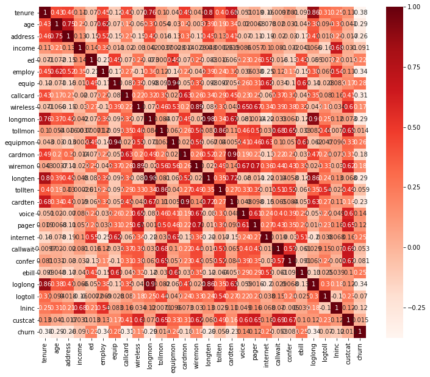
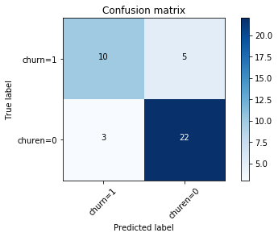

A telecommunications company is concerned about the number of customers leaving their land-line business for cable competitors. They want to know who is leaving


```python
import pandas as pd
import numpy as np
import scipy.optimize as opt
from sklearn import preprocessing
import matplotlib.pyplot as plt
%matplotlib inline
```


```python
#data prepro
df=pd.read_csv('https://s3-api.us-geo.objectstorage.softlayer.net/cf-courses-data/CognitiveClass/ML0101ENv3/labs/ChurnData.csv')
# print(df.head())
print(list(df))
print(df.head())

## feature selection
import seaborn as sns
plt.figure(figsize=(12,10))
cor = df.corr()
sns.heatmap(cor, annot=True, cmap=plt.cm.Reds,fmt='.2g')
plt.show()

# Correlation with output variable
dat_target = abs(cor['churn'])
#Selecting highly correlated features
relevant_features = dat_target[dat_target>0.5]
print(relevant_features)
```

    ['tenure', 'age', 'address', 'income', 'ed', 'employ', 'equip', 'callcard', 'wireless', 'longmon', 'tollmon', 'equipmon', 'cardmon', 'wiremon', 'longten', 'tollten', 'cardten', 'voice', 'pager', 'internet', 'callwait', 'confer', 'ebill', 'loglong', 'logtoll', 'lninc', 'custcat', 'churn']
       tenure   age  address  income   ed  employ  equip  callcard  wireless  \
    0    11.0  33.0      7.0   136.0  5.0     5.0    0.0       1.0       1.0   
    1    33.0  33.0     12.0    33.0  2.0     0.0    0.0       0.0       0.0   
    2    23.0  30.0      9.0    30.0  1.0     2.0    0.0       0.0       0.0   
    3    38.0  35.0      5.0    76.0  2.0    10.0    1.0       1.0       1.0   
    4     7.0  35.0     14.0    80.0  2.0    15.0    0.0       1.0       0.0   
    
       longmon  ...  pager  internet  callwait  confer  ebill  loglong  logtoll  \
    0     4.40  ...    1.0       0.0       1.0     1.0    0.0    1.482    3.033   
    1     9.45  ...    0.0       0.0       0.0     0.0    0.0    2.246    3.240   
    2     6.30  ...    0.0       0.0       0.0     1.0    0.0    1.841    3.240   
    3     6.05  ...    1.0       1.0       1.0     1.0    1.0    1.800    3.807   
    4     7.10  ...    0.0       0.0       1.0     1.0    0.0    1.960    3.091   
    
       lninc  custcat  churn  
    0  4.913      4.0    1.0  
    1  3.497      1.0    1.0  
    2  3.401      3.0    0.0  
    3  4.331      4.0    0.0  
    4  4.382      3.0    0.0  
    
    [5 rows x 28 columns]





    churn    1.0
    Name: churn, dtype: float64


As shown in figure, correlation values between independent variables and the label/target are not great. They even less than 0.5. The only one whose correlation value with churn is greater than 0.5 is the churn itself.  Probably the accuracy of prediction models would be far from impeccable.


```python
## feature selections, choose the variables with larger correlation value
df=df[['tenure', 'age', 'address', 'ed', 'employ', 'equip', 'callcard', 'wireless','longmon', 'churn']]
df['churn']=df['churn'].astype('int')
X = np.asarray(df[['tenure', 'age', 'address', 'ed', 'employ', 'equip','callcard','longmon']])
y = np.asarray(df['churn'])
```


```python
#scale
from sklearn import preprocessing
X = preprocessing.StandardScaler().fit(X).transform(X)
##train/test
from sklearn.model_selection import train_test_split
x_train,x_test,y_train,y_test=train_test_split(X,y,test_size=.2,random_state=4)
#model
from sklearn.linear_model import LogisticRegression
from sklearn.metrics import confusion_matrix
LR=LogisticRegression(C=0.001,solver='liblinear').fit(x_train,y_train)
##predict
ypred=LR.predict(x_test)
print(ypred)
ypred_prob=LR.predict_proba(x_test)
print(ypred_prob)
```

    [0 0 1 0 1 0 1 0 1 0 0 0 1 1 0 0 1 1 1 0 0 0 0 0 0 0 1 0 1 0 0 0 1 0 0 0 1
     0 0 0]
    [[0.51 0.49]
     [0.52 0.48]
     [0.5  0.5 ]
     [0.52 0.48]
     [0.5  0.5 ]
     [0.51 0.49]
     [0.49 0.51]
     [0.52 0.48]
     [0.47 0.53]
     [0.52 0.48]
     [0.52 0.48]
     [0.53 0.47]
     [0.49 0.51]
     [0.47 0.53]
     [0.53 0.47]
     [0.51 0.49]
     [0.49 0.51]
     [0.5  0.5 ]
     [0.49 0.51]
     [0.5  0.5 ]
     [0.51 0.49]
     [0.51 0.49]
     [0.54 0.46]
     [0.51 0.49]
     [0.5  0.5 ]
     [0.54 0.46]
     [0.5  0.5 ]
     [0.5  0.5 ]
     [0.49 0.51]
     [0.55 0.45]
     [0.53 0.47]
     [0.51 0.49]
     [0.48 0.52]
     [0.54 0.46]
     [0.52 0.48]
     [0.52 0.48]
     [0.48 0.52]
     [0.5  0.5 ]
     [0.55 0.45]
     [0.5  0.5 ]]


```python
##Evaluation
from sklearn.metrics import jaccard_similarity_score
print('jaccard',jaccard_similarity_score(y_test,ypred)) #measure similarity of y_pred and y_test
from sklearn.metrics import classification_report
import itertools
def plot_cm(cm,classes,normalize=False,title='Confusion matrix',cmap=plt.cm.Blues):
    if normalize:
        cm=cm.astype('float')/cm.sum(axis=1)[:,np.newaxis]
        print('Normalised confusion matrix')
    else:
        print('Confusion matrix, without normalisation')
    print(cm)
    plt.imshow(cm,interpolation='nearest',cmap=cmap)
    plt.title(title)
    plt.colorbar()
    tick_marks=np.arange(len(classes))
    plt.xticks(tick_marks,classes,rotation=45)
    plt.yticks(tick_marks,classes)
    fmt='.2f' if normalize else 'd'
    thresh=cm.max()/2
    for i, j in itertools.product(range(cm.shape[0]),range(cm.shape[1])):
        plt.text(j,i,format(cm[i,j],fmt), horizontalalignment='center',color='white' if cm[i,j]>thresh else 'black')
    plt.tight_layout()
    plt.ylabel('True label')
    plt.xlabel('Predicted label')
print(confusion_matrix(y_test,ypred,labels=[1,0]))
```

    jaccard 0.8
    [[10  5]
     [ 3 22]]


```python
##compute confusion matrix
cnf_matrix=confusion_matrix(y_test,ypred,labels=[1,0])
np.set_printoptions(precision=2)
##plot
plt.figure()
plot_cm(cnf_matrix,classes
=['churn=1','churen=0'],normalize=False,title='Confusion matrix')
plt.show()
print (classification_report(y_test, ypred))
from sklearn.metrics import log_loss
log_loss(y_test, ypred_prob) #uncertainty of your prediction based on how much it varies from the actual label.
```

    Confusion matrix, without normalisation
    [[10  5]
     [ 3 22]]





                  precision    recall  f1-score   support
    
               0       0.81      0.88      0.85        25
               1       0.77      0.67      0.71        15
    
       micro avg       0.80      0.80      0.80        40
       macro avg       0.79      0.77      0.78        40
    weighted avg       0.80      0.80      0.80        40
    


    0.6684452116407603


